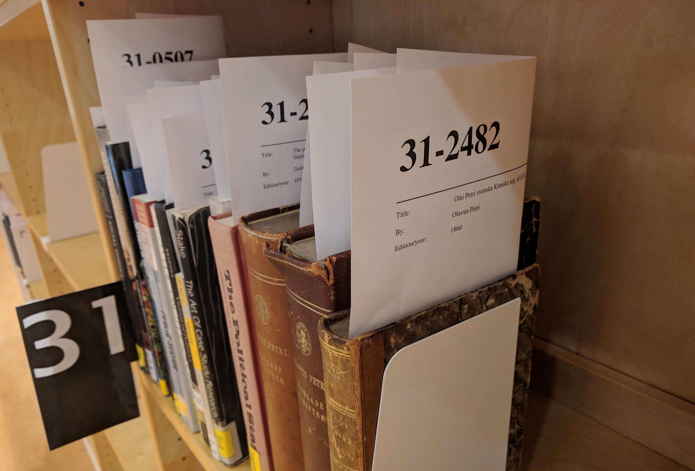

This is a collection of the XSL files used to generate letters and slips in
Alma, as customized by the University of Oslo Library. In general, we try to
make the files re-usable by others, but we fail in some cases.

We also have a Python script for synchronizing the files with Alma at
https://github.com/scriptotek/alma-slipsomat

## Overview of the .xsl files

Descriptions for the letters can be found in [Ex Libris Knowledge Base](http://knowledge.exlibrisgroup.com/Alma/Product_Documentation/Alma_Online_Help_%28English%29/Administration/Configuring_General_Alma_Functions/Configuring_Alma_Letters#Letter_Types).

Documentation for the fields is not available, and probably isn't something we
can expect anytime soon. Tamar Fuches wrote the following about it [on the Dev
forum](https://developers.exlibrisgroup.com/discussions#!/forum/posts/list/273.page):
"Regarding documentation, we do not have it currently. It will take time to get
this ready."

A curiosity of the letters is that typos are not uncommon; from the name
`FulReasourceRequestSlipLetter` to field names like `autho_initials` and what
have we, odd translation placeholders like `@@You_were_specify@@`. Anyways,
this doesn't affect the end result, it's just annoying to work with,
and makes you wonder if the application code is written using the same amount
of carelessness. Hopefully not.

### Letters usage

Some letters are used much more than others, and should be prioritized. A sample
of 3080 letters taken during a few days in June 2016 showed the following distribution:

    FulReasourceRequestSlipLetter : 1002
    FulTransitSlipLetter : 834
    FulPlaceOnHoldShelfLetter : 501
    ResourceSharingShippingSlipLetter : 215
    OrderListLetter : 99
    FulIncomingSlipLetter : 96
    FulPersonalDeliveryLetter : 87
    FulUserBorrowingActivityLetter : 75
    AnalyticsLetter : 64
    ConversationLetter : 32
    FulOutgoingEmailLetter : 32
    FulLostRefundFeeLoanLetter : 16
    PurchaseRequestStatusLetter : 7
    FineFeePaymentReceiptLetter : 6
    FulLoanReceiptLetter : 5
    FulReturnReceiptLetter : 3
    FulCancelEmailLetter : 2
    GeneralAssignToLetter : 1
    ProcessBibExportFinishedLetter : 1
    InterestedInLetter : 1
    POLineCancellationLetter : 1

In total, only 21 letters were used, but this was in the summer when we're not sending
overdue letters and such, so I should probably make a new sample later.

### Example XML data

Some examples XML files are provided in the `test-data` folder.
The files have been generated using test users or anonymized using
the provided `anonymize.sh` script.

### Templates

The files in `xsl/letters/call_template` contains templates used by the other
files. This means that if you intend to use some of our letter files, such as
`xsl/letters/FulReasourceRequestSlipLetter.xsl`, you also need to copy the
template files (or at least some of them).

Ideally, we would have created new template files to hold any new templates
we add, but since we aren't allowed to create new files, we have had to add
new templates to the existing files. Wherever a template is used, however,
we try to remember to add a comment indicating which template file the template
is defined in, to ease lookup.

Our current guideline is to use

* `mailReason.xsl` for all new templates, except templates having
  dependencies on other files (like `style.xsl`). This ensures that
  `mailReason.xsl` can be included in all files (also the sms templates)
  without having to ensure other files are also included. The templates in
  this file are templates we expect can be useful to others as well.

* `header.xsl` for the rest.

Quick overview of new templates we've added:

* `mailReason.xsl`: contains most templates, but not any that depends on other files (such as `style.xsl`).
  * `isoDate` : converts a date from `dd/mm/yyyy` to `YYYY-MM-DD` and strips away time, if present.
  * `stdDate` : converts a date from `dd/mm/yyyy` to `d. m Y` and strips away time, if present. Uses `monthName`
    to produce month names in the user's locale.
  * `pickupNumber` : Template for generating the pickup number.
  * `pickupNumberWithLabel` : More verbose version of the pickup number template.

* `header.xsl`: contains email design templates and templates with dependencies.
  * `head` : Organization logo, letter name (heading) and right-aligned date
  * `headWithoutLogo` : Letter name (heading) and right-aligned date
  * `logo` : Just the logo
  * `emailLogo` : Logo styled for email
  * `email-template` : The main email template

In the other template files we've only done smaller modifications to the
existing templates.

## Utskriftsløsning

USIT har opprettet egne epost-adresser for for alle kønavnene for printerne det
skal skrives til. Postmaster har konfigurert det slik at epost sendt til disse
adressene sendes direkte til et enkelt Bash-script, som skriver HTML-teksten fra
e-postene til disk og kaller html2ps for å konvertere fra HTML til PostScript,
som så sendes til riktig printerkø basert på hvilke adresse e-posten ble sendt til.

Fordeler med løsningen inkluderer at det går kjapt (utskriftene kommer "umiddelbart"
når man trykker "Print slip") og at det er en enkel løsning å drifte. En ulempe med
løsningen er at html2ps ikke støtter CSS, så vi kan bare gjøre enkel formatering.

## Spesielle elementer


### Hentehylle og hentenummer

#### `FulReasourceRequestSlipLetter` som hentehyllelapp

Det eksisterer foreløpig ikke en egen hentehyllelapp i Alma ([Se Ideas Exchange-forslag](http://ideas.exlibrisgroup.com/forums/308173-alma/suggestions/32042020-new-letter-for-hold-shelf-slips)).
Intensjonen til Ex Libris er at `FulReasourceRequestSlipLetter` skal brukes både
som hentelapp for bibliotekspersonalet *og* som hentehyllelapp, men for oss fungerte
det dårlig å bruke samme lapp til to nokså forskjellige formål. På hentehylla
kan vi blant annet ikke vise informasjon som identifiserer hvem som har bestilt
dokumentet av personvernhensyn.

Det vi har gjort er et hack for å få én stikkseddel til å fylle to behov. I pseudokode:

```
% if work_flow_entity/step_type = 'ON_HOLD_SHELF' then
    Hentehyllelapp retta mot bruker
% else
    Hentelapp retta mot personale
% endif
```

(Stikkseddelen fungerer forresten *også* som sendelapp, så den fyller egentlig *tre* behov)

Ulempen med denne løsningen er at en manuelt må trykke "Print slip" for å få ut hentehyllelappen
etter man har tatt "Scan In" for å registrere at dokumentet er hentet frem og klar for hentehylla.
På sikt håper vi Alma får en egen hentehyllelapp.

#### Hentenummer

Av personvernhensyn stiller vi opp dokumenter etter hentenummer, ikke navn.
Alma har ikke noen mulighet for å genere hentenummer enda (selv om det forhåpentligvis er på vei, [se Ideas Exchange-forslag](http://ideas.exlibrisgroup.com/forums/308173-alma/suggestions/16708234-on-hold-shelf-new-sorting-option)).
Enn så lenge generer vi derfor hentenummer selv på en litt hackete måte.
Det er svært begrenset hva man kan gjøre i et lukket XSLT-miljø, så vi har ikke funnet noen måte å generere garantert unike numre på.
I stedet generer vi numre som *stort sett* er unike. Vi har valgt å ha relativt korte numre (6 sifre), selv om det øker sjansen for en og annen kollisjon.



Nummeret vårt begynner med to sifre fra hentefrist-datoen (for å gjøre sorteringen av hentehylla enkel).
Deretter legger vi på to sifre fra en bruker-ID og to sifre fra en dokument-ID.
Numrene genereres i XSLT-malen`pickupNumber` i [`mailReason.xsl`](https://github.com/scriptotek/alma-letters-ubo/blob/master/xsl/letters/call_template/mailReason.xsl#L98-L109).
I tillegg har vi en mal `pickupNumberWithLabel` (i samme fil) som viser "Til henting i skranken" for dokumenter som ikke har hentefrist,
samt for enkelte bibliotek som ikke har selvbetjent hentehylle.

De to malene (`pickupNumber` og `pickupNumberWithLabel`) brukes av `FulReasourceRequestSlipLetter`
(selve hentehyllelappen), samt hentemeldingene
([FulPlaceOnHoldShelfLetter.xsl](https://github.com/scriptotek/alma-letters-ubo/blob/master/xsl/letters/FulPlaceOnHoldShelfLetter.xsl#L42-L52) og [SmsFulPlaceOnHoldShelfLetter.xsl](https://github.com/scriptotek/alma-letters-ubo/blob/master/xsl/letters/sms/SmsFulPlaceOnHoldShelfLetter.xsl#L26-L32)).


### Libnummer (norsk ISIL-kode)

Fire av sedlene brukes som sendelapper mellom bibliotek og har derfor libnummer
nederst. Nummeret må plasseres i en fast avstand fra bunnen av arket fordi det
skal være synlig i vinduskonvolutter for sending av dokumenter. For sending av
bøker stikkes sedlene i bøkene slik at arket stikker ut på bunnen av boka med
libummeret synlig.

* `FulReasourceRequestSlipLetter`: Utlån til folkebibliotek og andre bibliotek
  som ikke bruker Alma. Libnummer hentes fra
  `notification_data/user_for_printing/identifiers/code_value[1]/value`.
* `ResourceSharingShippingSlipLetter`: Utlån til annet Alma-bibliotek basert
  på bestillinger (*lending requests*). Libnummer hentes fra
  `notification_data/partner_code`.
  * Merk: `FulIncomingSlipLetter` (også kjent som `Resource sharing Lending
    Slip Letter`) ligner ganske mye på `ResourceSharingShippingSlipLetter`, og
    mange tror derfor denne kan brukes som sendeseddel for artikkelkopier –
    men denne mangler libnummer og adresseinformasjon og er nok ikke ment som
    det. Når bestillingen har fått status `Shipped` får man ut en
    `ResourceSharingShippingSlipLetter` som brukes som sendelapp. Gå til ship
    item via almamenyen, velg ship non returnable og huk av for automatisk
    slip. Eller trykk ‘print slip’ etter man har valgt ‘ship item’, ‘ship non
    returnable’ e.l.
* `ResourceSharingReturnSlipLetter`: Retur til annet Alma-bibliotek.
  Libnummer hentes fra `/notification_data/partner_address[1]/line5`.
  (Forhåpentligvis blir `notification_data/partner_code` definert her også
   etterhvert, men per desember 2017 er det ikke det).
* `FulTransitSlipLetter`: Sendelapp internt på UBO. Her har vi en hardkodet
  mapping fra `calculated_destination_name` til libnummer fordi libnummeret
  ikke er tilgjengelig i XML-dataene og lista over mottakere er overkommelig å
  vedlikeholde manuelt (mens vi venter på en bedre løsning).

For å få plassert libnummeret i en fast avstand fra bunnen av arket har vi
konfigurert html2ps
([dokumentasjon](http://user.it.uu.se/~jan/html2psug.html)) til å legge
innhold fra meta-taggen `libnummer` i bunntekst (footer):

```
@html2ps{
    footer {
      left: "$[libnummer]";
      center: " ";  /* override default value */
      right: "$[address]";
      font-size: 48pt;
    }
}
@page {
   margin-left: 2cm;
   margin-right: 3cm;
   margin-top: 0;
   margin-bottom: 6cm;
}
```

html2ps-oppsettet driftes av USITs [gruppe for drift av meldingstjenester](http://www.usit.uio.no/om/organisasjon/it-drift/kd/gmt/index.html). For å gjøre endringer i konfigurasjonen sender vi epost til postmaster at rt.uio.no der vi beskriver endringene – det har gått greit så langt, de svarer raskt.

Eksempel på en meta-tagg: `<meta name="libnummer" content="103 0310"/>`.


## Tips

* Documentation: https://knowledge.exlibrisgroup.com/Alma/Product_Documentation/Alma_Online_Help_%28English%29/Administration/Configuring_General_Alma_Functions/Configuring_Alma_Letters

* To prevent a letter from being sent:
  `<xsl:message terminate="yes">Optional explanation</xsl:message>`
  (see `FulCancelRequestLetter.xsl` for an example).

* Footer: The link targets for "Contact us" and "My account" are set as
  `email_my_account` and `email_contact_us` in the General Customer Parameters
  mapping table (Administration > General Configuration > Configuration Menu >
  Other Settings). Despite the naming, these can be http URLs.

* For Sublime Text users: Sublime Text does not highlight .xsl files by
  default. Click the current syntax type in the lower right corner of the
  window. This will open the syntax selection menu with the option to Open all
  with current extension as... at the top of the menu. Select XML.

* CSS support in e-mail clients varies alot! [This
  table](https://www.campaignmonitor.com/css/) is therefore super useful!

* `xsl:function` is *not* supported!

* XSLT processing will fail if a file has a `<xsl:call-template>` statement
  that refers to a non-existing template (or a template in a file you haven't
  included). This is even the case if the `<xsl:call-template>` statement is
  in a piece of code that is not used, such as in a template that is never
  called. It took me some time to realize this, because `xsltproc` from the
  command line doesn't fail in that case.

* Testing sms messages: From the "XML To Letter Admin" feature in Alma, you
  only receive one XML file for letters that are sent both on SMS and email.
  If you upload this XML file to the "Notification Template" form, you get the
  email version of the letter. A trick to test the SMS version the letter is
  to just alter the content of `<letter_type>`, for instance from
  `FulPlaceOnHoldShelfLetter` to `SmsFulPlaceOnHoldShelfLetter`, and voila,
  you can upload the letter and preview the SMS (with the first line
  containing the receiver and sender).

* Using `xsltproc` from the command line can be helpful for quick testing,
  albeit without translation string expansions. Example: if you have a file
  `PlaceOnHoldShelfLetter.xml` you've received from "XML To Letter Admin",
  calling `xsltproc --path xsl/letters/call_template
  xsl/letters/sms/SmsFulPlaceOnHoldShelfLetter.xsl PlaceOnHoldShelfLetter.xml`
  will produce:

  ```
  <?xml version="1.0"?>
  12345678 : UiO Realfagsbiblioteket.
  @@can_picked_at@@ UiO Realfagsbiblioteket.
  Hentes i skranken.

   The science of cheese. Av: Tunick, Michael H...

  @@note_item_held_until@@: 15. juli 2016.
  ```

  (Please ignore the xml header..)
